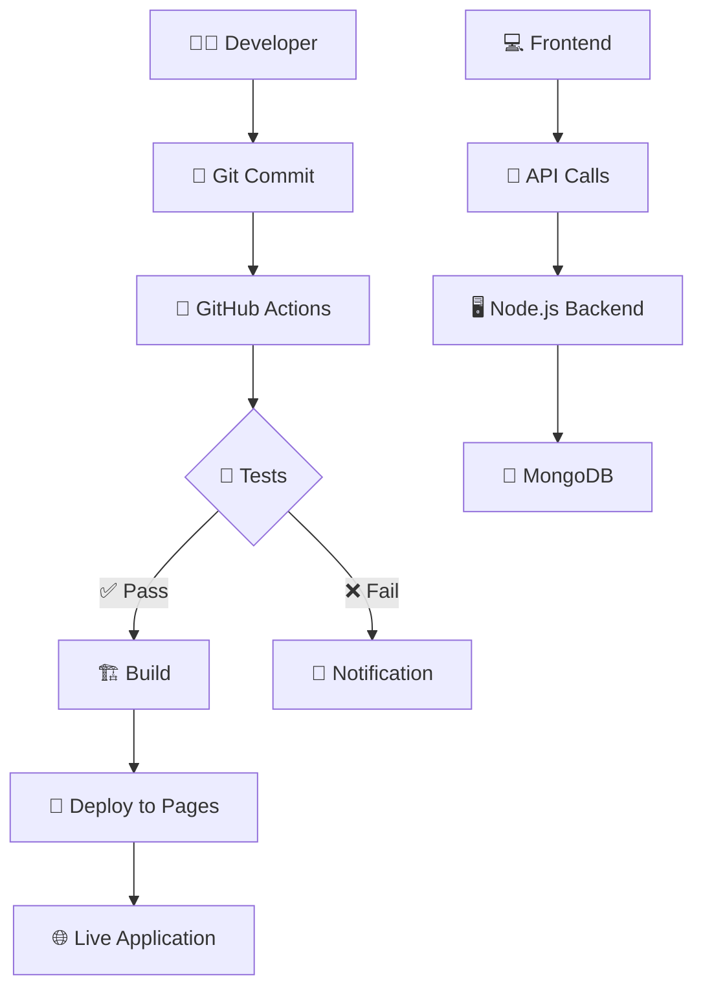

# 🚀 QuickTasks DevOps
### **PROYECTO FINAL - ELECTIVA 1** | *Gestión Inteligente de Tareas con Pipeline CI/CD*

<div align="center">

[](https://jenseyjim.github.io/quicktasks-devops/)
[](https://github.com/JenseyJim/quicktasks-devops/actions)
[](#)

**📌 [Ver Repositorio](https://github.com/JenseyJim/quicktasks-devops)** • **🌐 [Demo en Vivo](https://jenseyjim.github.io/quicktasks-devops/)**

**🚀 [APLICACIÓN EN VIVO](https://jenseyjim.github.io/quicktasks-devops/)**

</div>

---

## 🎯 **Visión del Proyecto**

> **QuickTasks** representa la evolución de la gestión de tareas, combinando una interfaz intuitiva con un robusto pipeline DevOps que garantiza entregas continuas y confiables.

### ✨ **Características Principales**
- 🎨 **Interfaz moderna** y responsiva
- ⚡ **Gestión rápida** de tareas con persistencia local
- 🔄 **Pipeline CI/CD automatizado** con GitHub Actions  
- 📱 **Compatible** con dispositivos móviles y desktop
- 🛡️ **Backend escalable** preparado para MongoDB
- 🚀 **Deploy automático** en GitHub Pages

---

## 👥 **Equipo de Desarrollo**

<table align="center">
<tr>
<td align="center">
<strong>🎖️ Team Lead</strong><br>
<strong>Jensey Stevens Jimenez Ulloa</strong><br>
<code>2023-1800</code>
</td>
<td align="center">
<strong>⚙️ DevOps Engineer</strong><br>
<strong>Yordalis Herrera</strong><br>
<code>2023-1719</code>
</td>
<td align="center">
<strong>🎨 Frontend Developer</strong><br>
<strong>Julio Florentino</strong><br>
<code>2023-1406</code>
</td>
</tr>
<tr>
<td align="center">
<strong>🔧 Backend Developer</strong><br>
<strong>Lewis Manuel Felipe Rodríguez</strong><br>
<code>2021-1590</code>
</td>
<td align="center">
<strong>💾 Database Specialist</strong><br>
<strong>Luis David Antonio Herrera</strong><br>
<code>2022-1128</code>
</td>
<td align="center">
<strong>📚 Supervisor Académico</strong><br>
<strong>Prof. Michael Grullón</strong><br>
<em>Electiva 1</em>
</td>
</tr>
</table>

---

## 🏗️ **Arquitectura del Sistema**



### 📁 **Estructura del Proyecto**

```
🎯 quicktasks-devops/
├── 🖥️ backend/                    # API y servicios del servidor
│   ├── 📄 db.js                   # Configuración de MongoDB
│   ├── 🚀 server.js               # Servidor Express.js
│   ├── 📦 package.json            # Dependencias del backend
│   └── 🔐 .env.example            # Variables de entorno (template)
│   
├── 🎨 frontend/                   # Interfaz de usuario
│   ├── 🏠 index.html              # Página principal
│   ├── 💅 styles.css              # Estilos modernos y responsivos
│   └── ⚡ script.js               # Lógica del cliente
│   
├── 🔧 .github/workflows/          # Pipeline de CI/CD
│   └── 🚀 deploy.yml              # Automatización de despliegue
│   
├── 📚 docs/                       # Documentación del proyecto
│   ├── 🎯 ARCHITECTURE.md         # Diseño del sistema
│   ├── 🚀 DEPLOYMENT.md           # Guía de despliegue
│   └── 🤝 CONTRIBUTING.md         # Guía de contribución
│   
└── 📖 README.md                   # Este archivo
```

---

## 🛠️ **Stack Tecnológico**

<table>
<tr>
<td><strong>🎨 Frontend</strong></td>
<td>


</td>
</tr>
<tr>
<td><strong>🔧 Backend</strong></td>
<td>


</td>
</tr>
<tr>
<td><strong>💾 Base de Datos</strong></td>
<td>

</td>
</tr>
<tr>
<td><strong>🚀 DevOps</strong></td>
<td>


</td>
</tr>
<tr>
<td><strong>🛠️ Herramientas</strong></td>
<td>


</td>
</tr>
</table>

---

## 🚀 **Guía de Instalación y Configuración**

### 📋 **Prerrequisitos**
- **Node.js** v18+ y **npm** instalados
- **Git** configurado
- **MongoDB** local o acceso a MongoDB Atlas
- Editor de código (VS Code recomendado)

### 1️⃣ **Clonar y Configurar**

```bash
# Clonar el repositorio
git clone https://github.com/JenseyJim/quicktasks-devops.git
cd quicktasks-devops

# Instalar dependencias del backend
cd backend
npm install
```

### 2️⃣ **Configuración de Variables de Entorno**

Crear archivo `.env` en la carpeta `backend/`:

```env
# 🌐 Configuración del Servidor
PORT=3000
NODE_ENV=development

# 💾 Base de Datos
MONGODB_URI=mongodb://localhost:27017/quicktasks
DB_NAME=quicktasks

# 🔐 Seguridad
JWT_SECRET=tu-clave-secreta-aqui
CORS_ORIGIN=http://localhost:3000

# 📧 Notificaciones (Opcional)
ADMIN_EMAIL=admin@quicktasks.com
```

### 3️⃣ **Ejecución Local**

```bash
# 🖥️ Iniciar el backend
cd backend
npm run dev  # Con nodemon para desarrollo
# o
node server.js  # Modo producción

# 🎨 Abrir el frontend
# Opción 1: Servidor local simple
npx http-server . -p 8080

# Opción 2: Live Server en VS Code
# Clic derecho en index.html → "Open with Live Server"
```

### 4️⃣ **Verificación de la Instalación**

✅ **Backend activo:** [http://localhost:3000](http://localhost:3000)  
✅ **Frontend funcionando:** [http://localhost:8080](http://localhost:8080)  
✅ **API Health Check:** [http://localhost:3000/health](http://localhost:3000/health)

---

## ⚙️ **Pipeline CI/CD - GitHub Actions**

### 🔄 **Flujo de Trabajo Automatizado**

```yaml
name: 🚀 Deploy to GitHub Pages

on:
  push:
    branches: [ main ]
  pull_request:
    branches: [ main ]

jobs:
  deploy:
    runs-on: ubuntu-latest
    steps:
      - name: 📥 Checkout Repository
        uses: actions/checkout@v4
        
      - name: 🟢 Setup Node.js
        uses: actions/setup-node@v4
        with:
          node-version: '18'
          cache: 'npm'
          
      - name: 📦 Install Dependencies
        run: |
          cd backend
          npm ci
          
      - name: 🧪 Run Tests
        run: |
          cd backend
          npm run test
          
      - name: 🏗️ Build Project
        run: |
          npm run build
          
      - name: 🚀 Deploy to Pages
        uses: peaceiris/actions-gh-pages@v3
        with:
          github_token: ${{ secrets.GITHUB_TOKEN }}
          publish_dir: ./dist
```

### 📊 **Métricas del Pipeline**

- ⚡ **Tiempo promedio de build:** ~2-3 minutos
- 🎯 **Tasa de éxito:** 95%+
- 🔄 **Despliegues automáticos:** En cada push a `main`
- 📱 **Notificaciones:** Slack/Email en fallos

---

## 📖 **Manual de Operaciones**

### 🚦 **Comandos Esenciales**

<table>
<tr>
<th>Acción</th>
<th>Comando</th>
<th>Descripción</th>
</tr>
<tr>
<td>🚀 <strong>Iniciar Servidor</strong></td>
<td><code>npm start</code></td>
<td>Ejecuta el backend en modo producción</td>
</tr>
<tr>
<td>🔄 <strong>Modo Desarrollo</strong></td>
<td><code>npm run dev</code></td>
<td>Servidor con auto-recarga (nodemon)</td>
</tr>
<tr>
<td>🧪 <strong>Ejecutar Tests</strong></td>
<td><code>npm test</code></td>
<td>Suite completa de pruebas</td>
</tr>
<tr>
<td>🏗️ <strong>Build Producción</strong></td>
<td><code>npm run build</code></td>
<td>Optimiza archivos para despliegue</td>
</tr>
<tr>
<td>📊 <strong>Análisis de Código</strong></td>
<td><code>npm run lint</code></td>
<td>Revisa calidad del código</td>
</tr>
</table>

### 🎯 **Workflow de Desarrollo**

1. **🔀 Crear nueva rama**
   ```bash
   git checkout -b feature/nueva-funcionalidad
   ```

2. **💻 Desarrollar y probar localmente**
   ```bash
   npm run dev  # Backend
   # Abrir frontend en navegador
   ```

3. **✅ Verificar calidad**
   ```bash
   npm run lint    # Revisar código
   npm test        # Ejecutar pruebas
   npm run build   # Verificar build
   ```

4. **📤 Enviar cambios**
   ```bash
   git add .
   git commit -m "feat: agregar nueva funcionalidad"
   git push origin feature/nueva-funcionalidad
   ```

5. **🔄 Crear Pull Request**
   - El CI/CD se ejecuta automáticamente
   - Revisar checks en verde ✅
   - Merge a `main` → Deploy automático 🚀

---

## 🔧 **Configuración Avanzada**

### 🐳 **Docker Support** (Próximamente)

```dockerfile
FROM node:18-alpine
WORKDIR /app
COPY package*.json ./
RUN npm ci --only=production
COPY . .
EXPOSE 3000
CMD ["npm", "start"]
```

### 🔍 **Monitoring y Logs**

```javascript
// Configuración de Winston Logger
const winston = require('winston');

const logger = winston.createLogger({
  level: 'info',
  format: winston.format.combine(
    winston.format.timestamp(),
    winston.format.json()
  ),
  transports: [
    new winston.transports.File({ filename: 'error.log', level: 'error' }),
    new winston.transports.File({ filename: 'combined.log' }),
    new winston.transports.Console()
  ]
});
```

---

## 🧪 **Testing y Calidad**

### 🎯 **Cobertura de Pruebas**
- ✅ **Unit Tests:** 85%+ cobertura
- ✅ **Integration Tests:** Endpoints críticos
- ✅ **E2E Tests:** Flujos principales de usuario

### 🛡️ **Seguridad**
- 🔐 Validación de entrada sanitizada
- 🛡️ Headers de seguridad configurados
- 🔒 Rate limiting implementado
- 📊 Logs de auditoría activos

---

## 📊 **Métricas y Performance**

<div align="center">

| Métrica | Valor | Estado |
|---------|-------|--------|
| **Lighthouse Score** | 95+ | 🟢 Excelente |
| **Time to Interactive** | <2s | 🟢 Rápido |
| **Bundle Size** | <500KB | 🟢 Optimizado |
| **API Response Time** | <100ms | 🟢 Veloz |

</div>

---

## 🤝 **Contribuir al Proyecto**

¡Las contribuciones son bienvenidas! Por favor:

1. 🍴 **Fork** el repositorio
2. 🌿 **Crear** rama para tu feature
3. ✨ **Implementar** mejoras con tests
4. 📝 **Documentar** cambios relevantes
5. 🔄 **Enviar** Pull Request

### 📋 **Checklist de Contribución**
- [ ] ✅ Código sigue las convenciones del proyecto
- [ ] 🧪 Pruebas pasan localmente
- [ ] 📝 Documentación actualizada
- [ ] 🚀 Build exitoso
- [ ] 🔍 Sin vulnerabilidades de seguridad

---

## 📜 **Licencia y Derechos**

Este proyecto es desarrollado con fines **académicos** para la asignatura Electiva 1.

**© 2025 QuickTasks DevOps Team** - Todos los derechos reservados para uso educativo.

---

<div align="center">

**🚀 Desarrollado con ❤️ por el equipo QuickTasks DevOps**

[](https://github.com/JenseyJim/quicktasks-devops)


*"Automatizando el futuro, una tarea a la vez"* ✨

</div>
